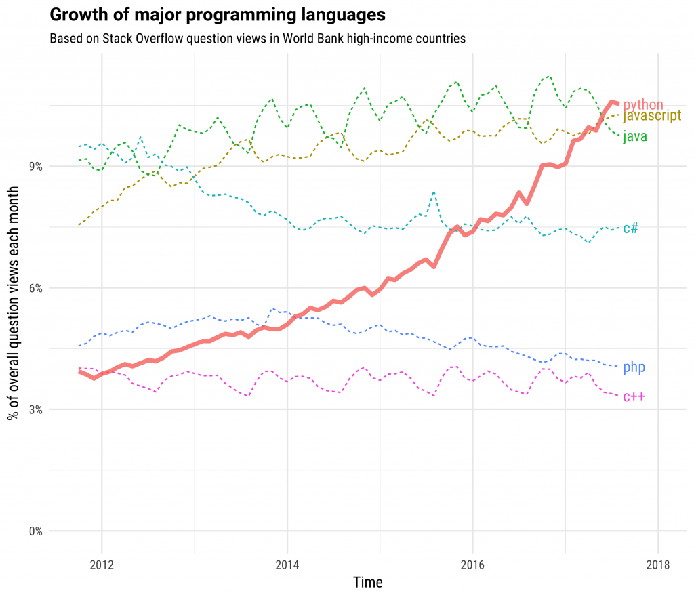
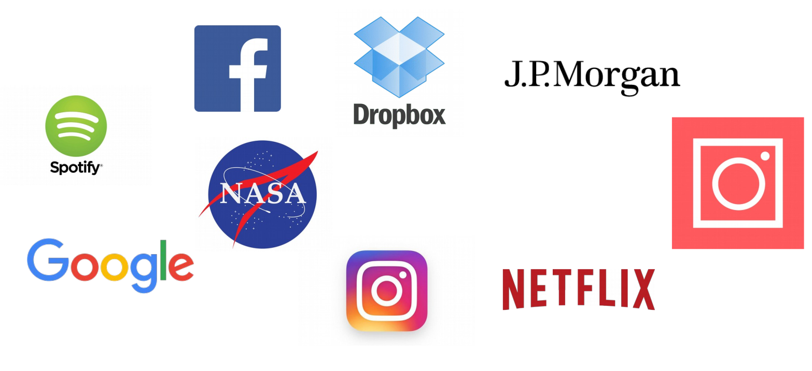
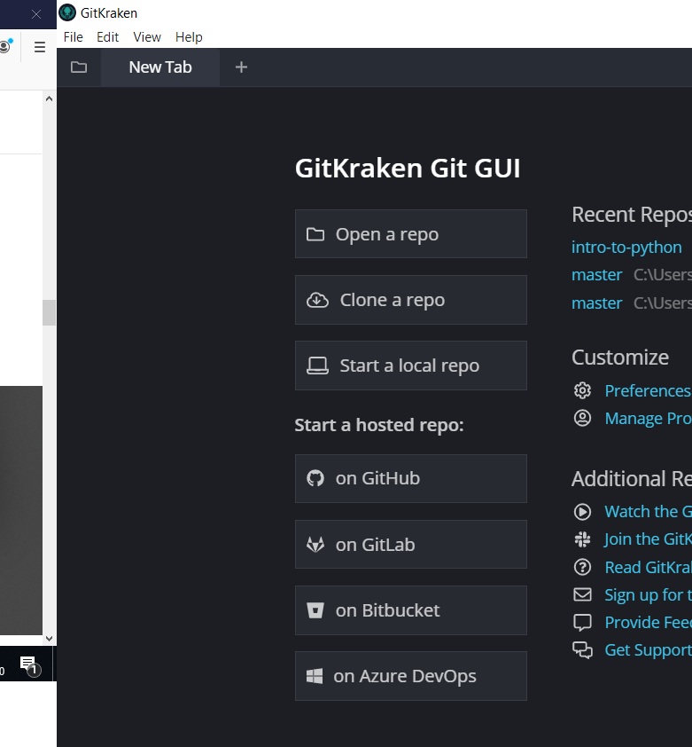
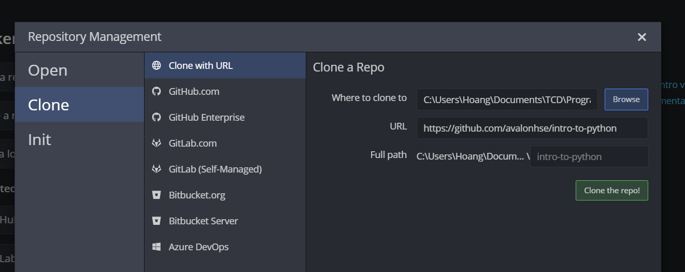
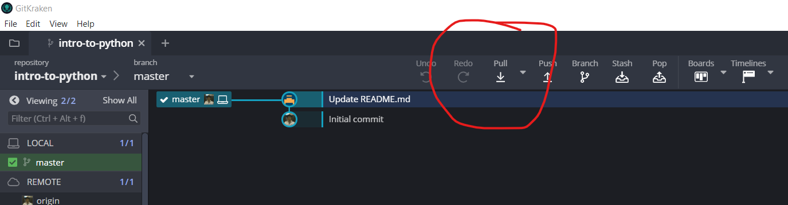
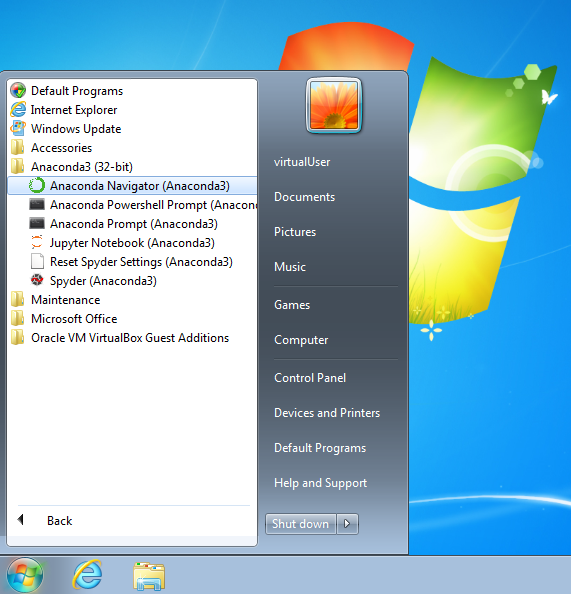
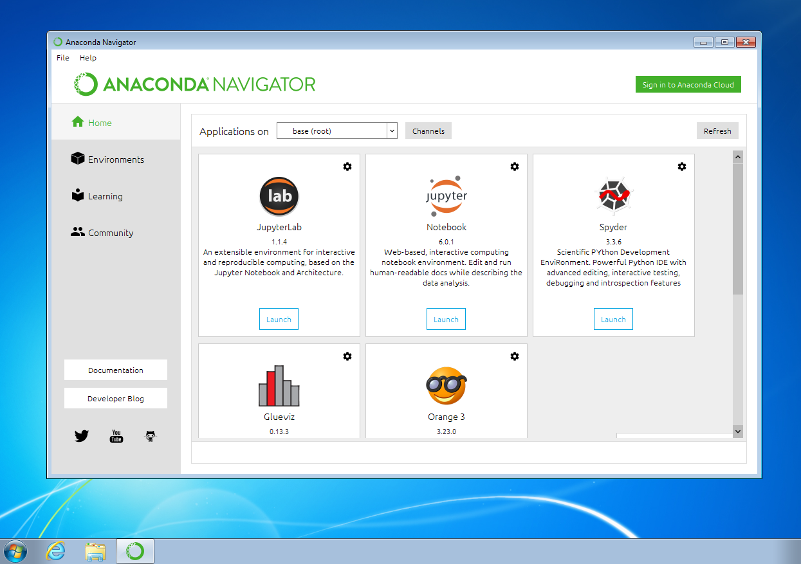
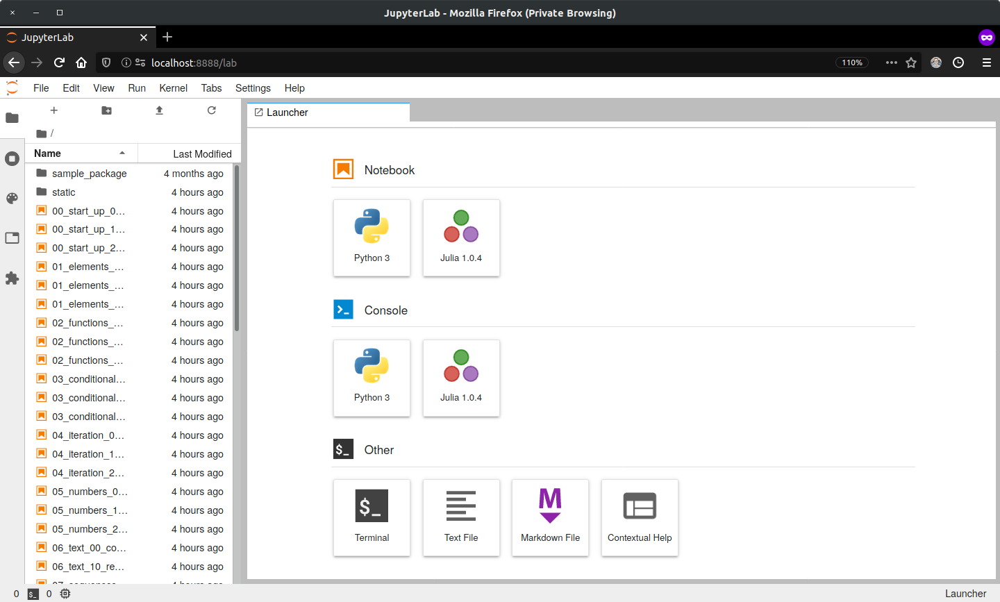
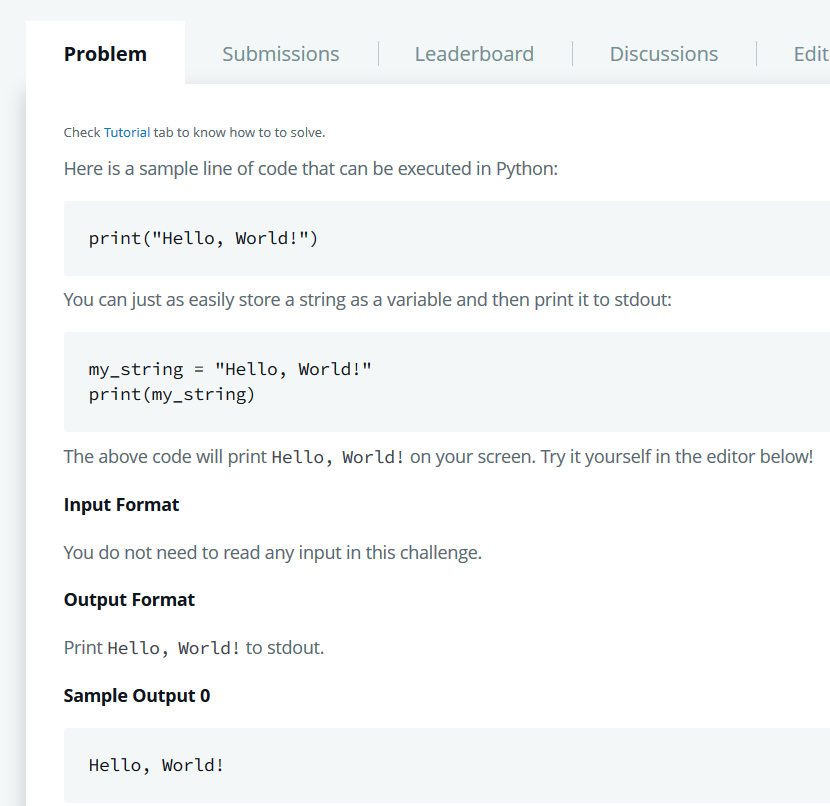
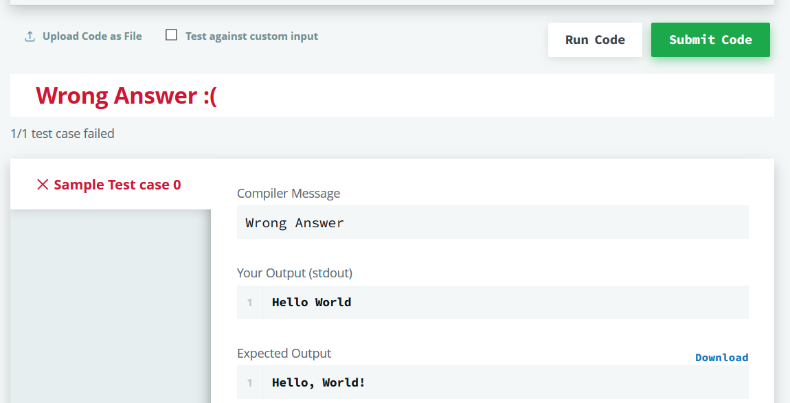

# An Introduction to Python and Programming

The **purpose** of this course is to provide **freely** a thorough introductory course on programming in the **[Python ](https://www.python.org/)** language to anyone interested. The course is for **non-profit purposes**.
All material are collected from online resources and customized to a free online Python course.

The course's **next goal** is to **prepare** the student for **further
studies** in the "field" of **data science**.

## Class Agenda (Keep updating)

The chapters are laid out in [Jupyter notebooks ](https://jupyter-notebook.readthedocs.io/en/stable/)
which are a de-facto standard for exchanging code and analyses among data science professionals and researchers.

### Month 1:
- *Chapter 0*: Introduction
- **Part A: Expressing Logic**
  - *Chapter 1*: Elements of a Program
  - *Chapter 2*: Functions & Modularization
  - *Chapter 3*: Conditionals & Exceptions
  - *Chapter 4*: Recursion & Looping

## Prerequisites

This course is suitable for *total beginners*, and there are *no* formal prerequisites. The student only needs to have:

- a *solid* understanding of the **English language**,
- knowledge of **basic mathematics** from high school,
- the ability to **think conceptually** and **reason logically**, and
- the willingness to **invest time and effort on this course**.

## Why Python?
Python is a **general-purpose** programming **language** that allows for *fast development*, is *easy to read*, **open-source**, long-established, unifies the knowledge of *hundreds of thousands of experts* around the world, runs on basically every machine, and can handle the complexities of applications involving **big data**.

#### Who use Python?

- **[Massachusetts Institute of Technology](https://www.mit.edu/)**
  - teaches Python in its [introductory course](https://ocw.mit.edu/courses/electrical-engineering-and-computer-science/6-0001-introduction-to-computer-science-and-programming-in-python-fall-2016/) to computer science independent of the student's major
  - replaced the infamous course on the [Scheme](https://groups.csail.mit.edu/mac/projects/scheme/) language (cf., [source ](https://news.ycombinator.com/item?id=602307))
- **[Google](https://www.google.com/)**
  - used the strategy "Python where we can, C++ where we must" from its early days on to stay flexible in a rapidly changing environment (cf., [source ](https://stackoverflow.com/questions/2560310/heavy-usage-of-python-at-google))
  - the very first web-crawler was written in Java and so difficult to maintain that it was rewritten in Python right away (cf., [source](https://www.amazon.com/Plex-Google-Thinks-Works-Shapes/dp/1416596585/ref=sr_1_1?ie=UTF8&qid=1539101827&sr=8-1&keywords=in+the+plex))
  - Guido van Rossom was hired by Google from 2005 to 2012 to advance the language there
- **[NASA](https://www.nasa.gov/)** open-sources many of its projects, often written in Python and regarding analyses with big data (cf., [source](https://code.nasa.gov/language/python/))
- **[Facebook](https://facebook.com/)** uses Python besides C++ and its legacy PHP (a language for building websites; the "cool kid" from the early 2000s)
- **[Instagram](https://instagram.com/)** operates the largest installation of the popular **web framework  [Django](https://www.djangoproject.com/)** (cf., [source](https://instagram-engineering.com/web-service-efficiency-at-instagram-with-python-4976d078e366))
- **[Spotify](https://spotify.com/)** bases its data science on Python (cf., [source](https://labs.spotify.com/2013/03/20/how-we-use-python-at-spotify/))
- **[Netflix](https://netflix.com/)** also runs its predictive models on Python (cf., [source](https://medium.com/netflix-techblog/python-at-netflix-86b6028b3b3e))
- **[Dropbox](https://dropbox.com/)** "stole" Guido van Rossom from Google to help scale the platform (cf., [source](https://medium.com/dropbox-makers/guido-van-rossum-on-finding-his-way-e018e8b5f6b1))
- **[JPMorgan Chase](https://www.jpmorganchase.com/)** requires new employees to learn Python as part of the onboarding process starting with the 2018 intake (cf., [source](https://www.ft.com/content/4c17d6ce-c8b2-11e8-ba8f-ee390057b8c9?segmentId=a7371401-027d-d8bf-8a7f-2a746e767d56))

## Course Materials
All the course material will be put into the subfolder "Class_Contents". In the "Class_Contents", there are 3 sub-subfolders:
- **Classes** : content teaching on class 
- **ReviewLession** : questions to review previous class
- **Exercises** : homework submitted to tutors

## Software and tools installation for the course

#### 1. GitKraken

The course materials will continually weekly updated on this Github folder "Class_Contents". [GitKraken](https://www.gitkraken.com/) is a free powerful graphical interface for Git which can be used to update the course materials. Just go to the [download](https://www.gitkraken.com/download) section and install the latest version for your operating system.

- **Download the course material** 
To download the course material the first time, open GitKraken and choose "Clone the repo". 

Then in the Tab "Clone with URL" choose the local folder where you want to keep all course materials. In the next form "URL", paste "https://github.com/avalonhse/intro-to-python" and click "Clone the repo". The GitKraken will create a new folder with all materials downloaded in your chosen location.

- **Update the course material** 
The course material will be updated before the class starts. To update the material, open GitKraken, choose the folder intro-to-python, and click on the Pull command.

Then GitKraken will update the new material for you in the intro-to-python folder.

#### 2. Anaconda

Anaconda is a free and open-source distribution of the Python aims to simplify installations of Python tools and libraries. 

To follow this course, a working installation of **Python 3.7** or higher is expected.

A popular and beginner friendly way is to install the [Anaconda Distribution](
https://www.anaconda.com/distribution/) that not only ships Python but comes pre-packaged with a lot of third-party libraries from the so-called "scientific stack". Just go to the [download](https://www.anaconda.com/distribution/#download-section) section and install the latest version for your operating system.

Then, among others, you will find an entry "[Anaconda Navigator](https://docs.anaconda.com/anaconda/navigator/)" in your start menu like below.
Click on it.

A window opens showing you several applications that come with the Anaconda Distribution. Now, click on "JupyterLab."

A new tab in your web browser opens with the website being "localhost" and some number (e.g., 8888). This is the [JupyterLab ](https://jupyterlab.readthedocs.io/en/stable/)
application that is used to display and run the notebooks mentioned above.

On the left, you see the files and folders in your local user folder. This file browser works like any other. In the center, you have several options to launch (i.e., "create") new files.

#### 3. HackerRank

HackerRank is a wonderful online platform which contains numerous online coding tests for student to practice their coding skills. Software companies also use HackerRank technical assessment and remote interview solution for hiring developers. Student will see a coding prolem in HackerRank in a form of problem description, sample input and expected output. 

The task is writing the code according to problem description so that the code will take the sample input and print out the expected output. 

Our course target is completing some (may not all) [HackerRank Python problems](https://www.hackerrank.com/domains/python?filters%5Bsubdomains%5D%5B%5D=py-introduction). In order to do that, please register your account in HackerRank in the link below:
[HackerRank SignUp](
https://www.hackerrank.com/auth/signup?h_l=body_middle_left_button&h_r=sign_up)

## Last words
The purpose of this course is non-profit and by no means commercial. It is conducted as an effort of motivating anyone to learn Python for their careers.

## Credits
This application uses Open Source components. You can find the source code of their open source projects along with license information below. We acknowledge and are grateful to these authors:

1. Project: An Introduction to Python and Programming https://github.com/webartifex/intro-to-python
Copyright (c) 2019 Alexander Hess [alexander@webartifex.biz]. All right reserved.
License (MIT) https://github.com/webartifex/intro-to-python/blob/master/LICENSE

References: 
1. Miller, Brad, and David Ranum. "Problem solving with algorithms and data structures." (2013).